# Welcome to Nudl Guide

Nudl is a payment app which facilitates payouts to multiple users from your Safe and personal wallet.   

It’s easy to understand, straightforward to use, and flexible enough to fit your workflow.

All you need to do is choose your preferred transaction path.

## 🔍 Installing Nudl on Discord ✅

What to look out for when installing Nudl on your system!

### *1. Install the bot to your server*

To install on your server, click on the installation link (available, soon):

Then grant permission:

Nudl is installed:

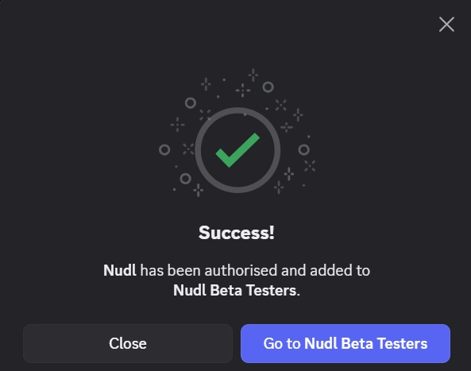

### 2. Customise permissions globally for your **server**

By default, Nudl is granted access to all channels, and all users have access to Nudl. If you wish to restrict this access to a specific channel or users, navigate to your server name at the top left of your screen, click on the “v” next to the server name to open the dropdown menu. Head to:

Server Settings → 

Integrations → 

Bots and Apps

Head to **Nudl** and press **Manage** to see the Command Permissions. Here, you can limit Nudl to particular “Channels” as well as “Roles & Members”. Default setting is All channels, All Members. In the “Commands” section you can open or limit access to Nudl commands to certain users or tags. See the Discord domumentation for further details how to use this feature.

>📌 **Note:** By design **Nudl admin** commands can only be accessed by **Discord server admins**. Therefore it is not possible to delegate admins permissions to members without Discord admin rights in your server.

>🛠️ **Work Tip:** Depending on the size of your community, we suggest using a designated channel for Nudl to avoid messages and prompts from going under.

### *3. Private channels: customise permissions locally per **channel***

*Set Nudl:*

*If a channel is set to **private,** you need to add Nudl to the channel manually:*

Head to the chosen channel → Edit channel (⚙️) → “Permissions” → “Add Members or roles”

Select Nudl from the **Roles** listing and add:

*Set Nudl permissions:*

Back on the Permissions  tab scroll down and open the “Advanced Permissions”. Select Nudl to the left and make sure the “View Channel” permission is activated: 

>✅ ** Congratulations:** You have successfully installed Nudl!

## 👥 User Sections

### What you need to know as a  User ✅

Nudl is easy and safe to use. A user can access and manage their profile using a single command and retain full control over their data. An Admin cannot add, modify or remove user data. In particular, a user can:

- Add addresses
- Update addresses
- Remove addresses
- View profile

>📌 ***Note:*** Admins cannot add, modify or remove addresses a user sets in Nudl, but they can process, filter and download them into a file to manage them on or offline, among other to process payments or for accounting purposes.

### Getting started

To open your profile type **/nudl** in the Discord chat.

Press Enter to open your profile:

### Add Addresses

To add your wallet address, select **Add / update**.  You can set individual addresses for each network or set the same address for all networks.

To set an individual address per network **Select a network**. 

Or select **Set same addresss on all networks**:

### Update Addresses

Before you update individual or all networks, review options before confirming.

When updating individual networks:

When updating all networks choose between **override all set networks values** or add only to **networks without set values**:

    
### Remove Addresses

You have the option to remove individual or all addresses:

To remove an address, select a network and then **Yes, remove**:

Or select **Remove all addresses** and then **Yes, remove all**:

### View Profile

After setting your addresses, access your ****profile using **←Back** button or **/nudl** command.

**Show full** to expand:

tutorial addresses

0x9ebda21de56278951a73f20dc2bac54e3edca6c0

0xf3f24e5fbd6efcdbeddac59bdcdfaf5ee3a720ab

## ⚙️ Admin Sections

### Quickstart ✅

The Quickstart Guide runs you through the steps when setting up Nudl for the first time, inplementing its core functions.

#### Install Nudl

 Follow the "Installing Nudl" chapter above to set up Nudl on your Discord server.

#### Admin permissions

>📌 **Note:** You need to be a Discord server admin to run Nudl admin commands.

#### Admin Dashboard

Type **/nudl-admin** into the Discord chat:

 

Press **Enter** to open the Admin dashboard:

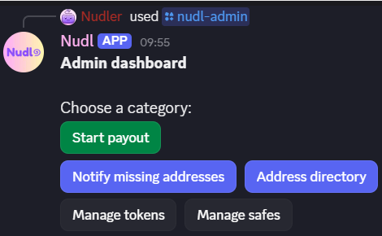

#### Manage tokens

Preset the tokens you customarily disburse to speed up the payment process. Tokens are added to each network. There is no limit of tokens you can add per network. Start by selecting a network and then press **Add token**:

Add you token contract address into the modal and **Submit**.

>ℹ️ ***Information:*** You can find token contract addresses in the project documentation or on sites such as [coingecko.com](http://coingecko.com) (DYOR!), see:

>🛠️ ***Work Tip:*** You can also add tokens while conducting a payment in the Safe and CSV Airdrop payment stream.

#### Manage Safes

Preset your payment Safe address. Nudl currently only supports one Safe per network.

Start by selecting a network and then press **Add Safe**:

Copy address  from [Safe.global](http://Safe.global) to enclude the network prefix:

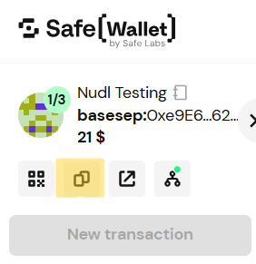

Add to modal and submit:

#### Notify Users

When setting up Nudl in your community, ensure to onboard as many users as possible. Make an announcement and use Nudl’s built-in **notification tool** by pressing the **Notify missing addresses** button on Admin dashboard.

To address all community members select a **Network**. Choose additional filters to refine:

Click **Next: choose send channel** to specify in which channel you want to address your community. Make sure Nudl is enabled there.

Then **Send notification**:

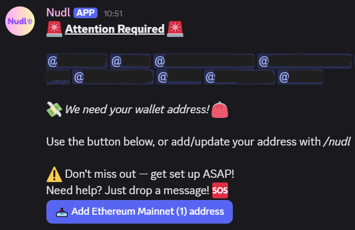

>✅ ***Congratulations:*** You have succcessfully set up Nudl! 🎉

### Admin Introduction ✅

At Nudl, access to **admin command lines** is restricted to **Discord administrators**. 

What a Nudl Admin can do:

- Create and execute disbursements
- Identify and notify users who have not set their address on Nudl
- Access and browse the address directory using different filter settings
- Manage token and Safe addresses

What a Nudl Admin cannot do:

- Admins are not able to add, modify, or delete wallets users have set in Nudl.

>ℹ️ ***Information:*** Nudl supports token transfers based on token addresses. Native gas tokens such as ETH on the Ethereum Mainnet or SOL on Solana do not possess a token contract and are currently **not** supported.

>💡 ***Donations:***  
You have the option to support the work at Nudl.
The donation wallet address set in the system is: **0x18f89f1cd153644e3ef6e70894c0673f7feb46e9**

### Nudl Administration ✅

#### Adding a token during disbursement

Nudl offers two ways to add a token.

**Option 1**: Select Manage tokens, see Quickstart for details.

**Option 2**: Add tokens while building your **Safe** or **CSV Airdrop** disbursement file. The process is identical for all disbursement paths. We will use the Safe disbursement to illustrate.

First, open the **Admin dashboard** with **/nudl-admin** and Select **Start payout**:

Select **Safe** or **CSV Airdrop**:

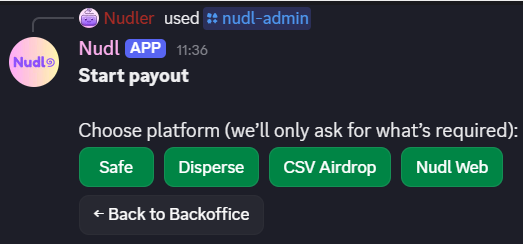

**Set Token Address**:

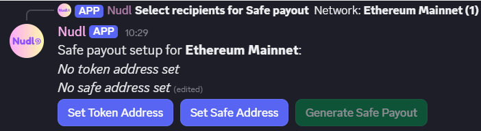

Click on **Choose an existing token or add a new one**:

Click on **Add a new token (not listed)**:

Add the token contract address and **Submit**:

>✅ ***Congratulations:*** You have sucessfully added and saved a new token to the Safe or CSV Airdrop payment stream.

>📌 **Note:** The token address is saved and available in the future. To remove it, select **Manage token** in the **Admin Dashboard**.  For further information where to obtain a token contract address refer to Quickstart for further details.

#### Cancelling adding a token

The **Add Token Address** modal was opened but your pressed **Cancel**:

System considers the cancellation as final and closes the process:

  
>📌 **Note:** If for any reason the modal is cancelled without adding a token contract you cannot reopen it again immediately. To reinitiate the process you have two options:

**Option 1**: press **Back to Payout Setup** and re-enter **Set Token Address**:

**Option 2**: provisionally select another token of your dropdown list:

Then **Edit Token Address** and re-select **Add a new token (not listed)**:

>✅ ***Congratulations:*** You have sucessfully restarted the Add Token Address flow.

#### Editing a disbursement file

You can edit any of the final disbursement files to address errors or to simply modify. Press the **Edit CSV** and it will bring you back to the section where you set the amounts for each user. 

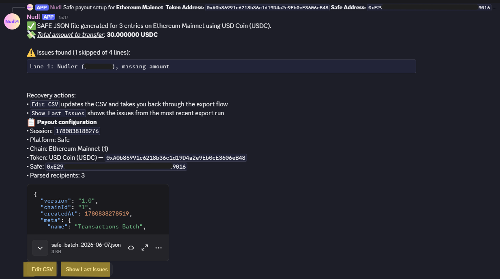

Review any issues found by accessing **Show Last Issues**.

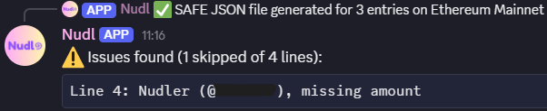

##### Editing

To modify your payment file select **Edit CSV**.  This will bring you back to the start of the payment process stating witht he modal of selected recipients. You can adjust any steps as necessary or just click through the steps.

>📌 **Note:** The Edit CSV option does not allow you to change the selected network. In this case you willl need to restart the entire disbursement path. 

>🛠️ ***Work Tip:*** In case you need to restart the disbursement process because you selected the incorrect network, you do not need to add all user values afresh:

- Open **Edit CSV** of your old disbursement form, copy all users and their values
- Restart a new disbursement path with the correct network
 - Once you added a network you will see the following options:

- Select **Manual paste** which will open the user modal.
- Past the users and values you copied earlier and proceed as usual.
   
#### Remove a token

To remove a token open the **Admin dashboard**, select **Manage tokens** and **Select a network**:

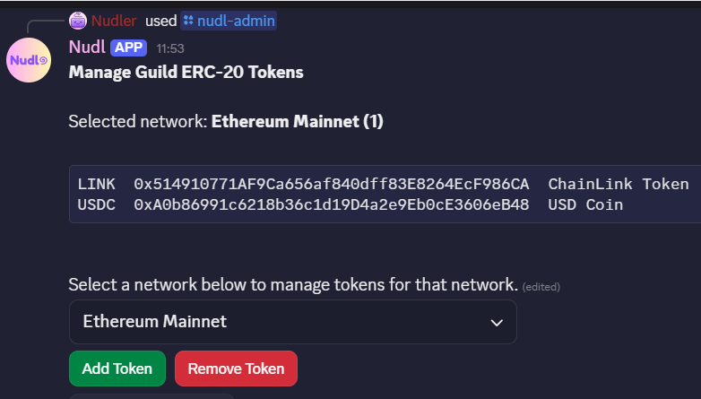

Click **Remove Token**, then **Select a token to remove** and choose a token from the list:

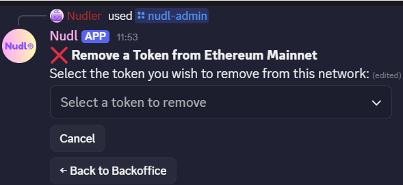

Confirm **Yes, Remove**:

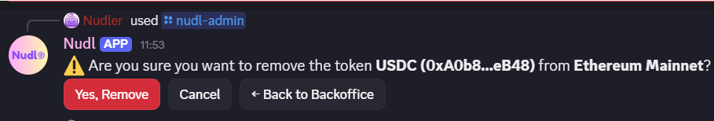

You have the options to manage further tokens:

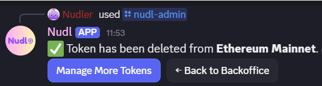

  
>✅ ***Congratulations:*** You have sucessfully removed a token from Nudl.

#### Manual paste

All payment paths allow to manually ingest user and payment data:

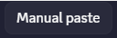

This can be a helpful and speedy way to manage repeat payments to the same recipients with the same values that you have conducted in the past and have stored in a previous disbursement file. Make sure you paste the data in the correct format. 

>📌 **Note:** Discord has a 4000 character limit, which accommodates approximately 100 users if you use Discord ID codes.

### Start Payout

#### Introduction

Nudl currently supports disbursements on [SAFE](https://safe.global/), [Disperse](https://disperse.app/), [Smol](https://smold.app/disperse) and Nudl Web.

>ℹ️ ***Information:*** - You can enter decimal values in Nudl by using a decimal point: “**.**” - All disbursement paths allow assigning one numeric payment value per user. - In Nudl Web you additionally have the option to cumulatively or alternatively add point values to users.

#### Conduct a payout on **SAFE** ✅

##### Step 1: Create a payout form in Nudl

Select **Start payout** on the Nudl Admin dashboard:

Select **Safe**:

Select a network:

Optionally select channel or role filter do best target the payout group. Press **Set amounts**:

Add payment values after the comma:

Add an optional **Donation** amount to the transaction to support work at Nudl.

Or  **Continue Safe setup**:

Add any donation amount here, **Submit** and then **Continue Safe setup**:

Select a token and Safe address you have set up as described in the **Quickstart** section. Alternatively, set a new token address or set/replace a Safe address:

**Set Token**:

**Set Safe Address**:

After setting you have the option to edit both addresses again:

Generate Safe Payout JSON file and download:

##### Step 2: Upload Nudl payout form to Safe

Open your [SAFE](https://safe.global/) account and first verify that the address and network correspond with the selections made in **/admin_safe_payout**. After that, click on “New transaction” and then on “Transaction Builder”.

 Alternatively, navigate to the “App” section and select “Transaction Builder”.

Upload the JSON file downloaded in step 1 above by clicking on the “*choose a file*” button located in the bottom right corner:

Press “*Create a Batch*“:

To review individual transactions, click on the pencil icon. If you are familiar with the process, you can make specific edits in the form, such as adjusting the values.

To ensure everything is configured properly, simulate the transaction.

If the simulation is successful begin the transaction by clicking "Send batch" and follow your usual multisig setup process.

>✅***Congratulations:*** You have succcessfully concluded your SAFE transaction!

#### Conduct a payout using **Disperse** and **Smol dApp** ✅

##### Step 1: Create a payout form in Nudl

Select **Start payout** on the Nudl Admin dashboard:

Select **Disperse**:

**Select a network**:

Optionally select channel or role filter do best target the payout group. Press S**et amounts**:

Add payment values after the comma:

Add an optional **Donation** amount to the transaction to support work at Nudl.

Or  **Generate Disperse file**:

Add any donation amount here:

Generate Safe Payout CSV file and download:

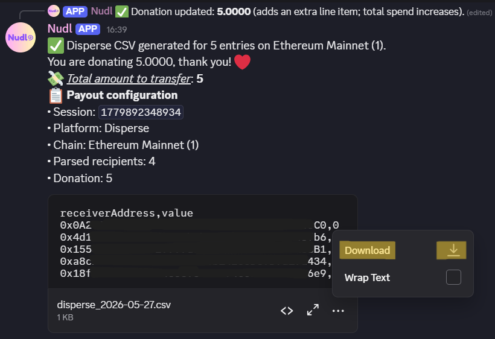

##### Step 2: Upload Nudl payout form to Disperse and Smold.app

###### A. Upload to Disperse

Open [Disperse](https://disperse.app/) and login with your wallet of choice. Set your wallet to the network and wallet address from which you want to make the transfer from.

Select the network on Disperse:

Select between ETH or token disbursement. If you choose a token add the token contract address. For more information where to find these see our Quickstart section. Then **load**:

Open the Nudl file and **copy** the data which can include the headings.

**Paste** into the “recipients and amounts” field:

For confirmation the exact payment amounts, total and the wallet balance holding are calculated instantly:

Approve token and disburse:

>✅***Congratulations:*** You have succcessfully concluded your Disperse transaction!
  

###### B. Upload to Smold.app

To begin, choose Disperse at [Smol](https://smold.app/disperse), select the Disperse tab and log in with your preferred wallet.

Select your token address. The Smol app allows you to search by token address or you can add one from a third party source. More information on token addresses see Quickstart :

Upload the CSV file we downloaded from Nudl using **Import Configuration**:

Check the upload details:

Check the total amount, approve and execute the payout:

>✅***Congratulations:*** You have succcessfully concluded your Smold.app transaction!

>📌 **Note:** If “No token selected” appears in the token field, please check that your wallet holds a balance of the selected token.

#### Conduct a payout using **CSV Airdrop** ✅

##### Step 1: Create a payout form in Nudl

Select **Start payout** on the Nudl Admin dashboard:

Select **CSV Airdrop**:

**Select a network**:

Optionally select channel or role filter do best target the payout group. Press **Set amounts**:
        

Add payment values after the comma, then **Submit**:

Add an optional **Donation** amount to the transaction to support work at Nudl.
        
Or **Select token**:

Add any donation amount here and **Submit** then **Select token**:

Select a token you have set up as described in the **Quickstart** section. Alternatively, set a new token address:

**Generate CSV Airdrop file**:

**Generate CSV Airdrop file** and download:

##### Step 2: Upload Nudl payout form to CSV Airdrop in Safe

Open your [SAFE](https://safe.global/) account and first verify that the address and network correspond with the selections made your Nuld payout file. 

Search for CSV Ardrop under App section.

Select:

Confirm:

Upload the Nudl disbursement file downloaded above:

Upload the Nudl CSV file:

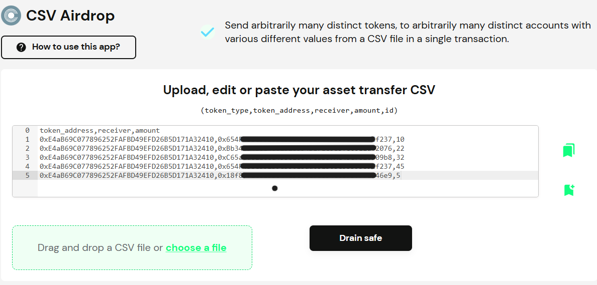

>📌 ***Note:*** To speed things up you can expand the file field in Nudl (or open the downloaded Nudl file) **copy** the data **including** the headings, and **paste** into the CSV Aridrop data field:

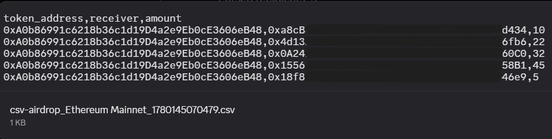

Review all entries, check amounts and total in **Summary** then **Submit**:

Start the Safe Multisig transaction:

>✅ ***Congratulations:*** You have succcessfully started your CSV Airdrop transaction!

#### Conduct a payout using **Nudl Web** ⚠️

##### Step 1: Create a payout form in Nudl Web

Select **Start payout** on the Nudl Admin dashboard:
admin-dashboard:

Select **Nudl Web:**

**Select a network**:

Optionally select channel or role filter do best target the payout group. Press **Set amounts**:

Add payment **values** and/or **points** after the comma, then **Submit**:

**Generate Nudl Web CSV**:

Download the CSV file/connect to Nudl web:

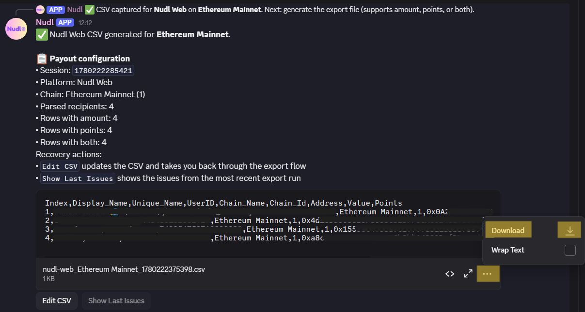
        
##### Step 2: Upload Nudl disbursement to Nudl site

**coming soon**

>✅ ***Success:*** You have succcessfully concluded your Nudl Web transaction!

### Address Directory ✅

Nudl admins can manage payment flows by accessing different filtering options. It also helps discover duplcate addresses.

#### Admin Dashboard

Click the **Address directory** button on the Admin dashboard:

The Nudl provides you with different options:

#### Browse directory

Select Browse directory, then set the desired filters. Choose amongst Network (mandatory), Role and Channel:

This will list the respective wallet holders and their corresponding addresses. You have the option to export your search results as CSV file.

>🛠️ ***Work Tip:*** Make sure you are as specific as possible, as Discord has a character limit in place which may prevent the display of all filtered users.

#### Lookup by address

To clarify whether an address is associated with a user, select **Lookup by address**, add the address to the modal and **Search**:

#### Lookup by username

To clarify which address is associated with a particular user, select **Lookup by username**:

This will list the respective wallet holder and their corresponding addresses. You have the option to export your search results as CSV file.

### Nofity missing addresses ✅

Nudl features a notification tool to inform users fo your community to add their wallet address to the system. You can use this for general onboarding or when you are about to prepare a disbursement.

Use **/nudl-admin** to open the Nudl **Admin dashboard** and select **Notify missing addresses**:

Select a **Network (required)**, fine-tune further using channel and role filters :

 

**Next: choose send channel**:

Modify default channel where to post the notification. Nudl must be enabled there!

Then **Send notification**:

If you send a notification to a channel in which Nudl is not activated:

If you send a notification to a channel to which a user has no access:

You will receive a confirmation once successfully sent:

Users can choose to use the dedicated **Add address button** or **/nudl** command:

Press the **Add token address** button to open the modal:

Anyone in the channel has button access. A user with an address already set is informed:

Once saved you will receive your address overview:

### Manage tokens and Safes ✅

#### Introduction

How to add tokens and safes is discussed in **Quickstart** section.

We will review how to **remove** each here.

Open the Admin dashboard using **/nudl-admin** and select **Manage tokens** or **Manage Safes**:

#### Removing a token

Select a network:

Choose Remove Token

Select the token to be removed:

Confirm **Yes, Remove**:

The removal is confirmed:

>✅ ***Congratulations:*** You have succcessfully removed your token from Nudl!

  
#### Removing a Safe

Select **Remove Safe**:

**Select Safe to remove**:

Confirm **Yes, remove**:

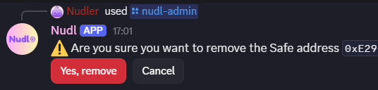

The removal is confirmed:

>✅ ***Congratulations:*** You have succcessfully removed your Safe from Nudl!

Leftover docs:

The donation wallet address is: 0x18f89f1cd153644e3ef6e70894c0673f7feb46e9

>💡 ***Pro Tip:***  fill as required

>ℹ️ ***Information:*** Nudl supports token transfers based on token addresses. Native gas tokens such as ETH on the Ethereum Mainnet or SOL on Solana do not possess a token contract and are currently **not** supported.

 
>📌 **Note:** You can also manually add this data using Discord display or unique names, which may be quicker for smaller groups. Enter one line per entry. Please note that there is a 4000 character limit, which accommodates approximately 100 users if you use Discord ID codes.

  
### Nudl Flow Visualisation

#### **SAFE**

#### **Disperse / Smold**

#### **Nudl Web**

# 📚 Glossary & References

## Nudl Editing and formatting

## Truncated Discord IDs

  
>🛠️ ***Work Tip:*** Generating the CSV file often truncates (shorten) the Discord IDs. To prevent this, consider uploading your CSV file to Google Sheets. For guidance, visit: [How to Open a CSV File in Google Sheets - GeeksforGeeks](https://www.geeksforgeeks.org/how-to-open-a-csv-file-in-google-sheets/).

If you use LibreOffice or Excel instead, following these steps:

1. Double-click on the downloaded CSV file.
2. The text import editor will appear:
3. Highlight the Discord ID column and change the formatting to “Text,” then click “OK” to import.

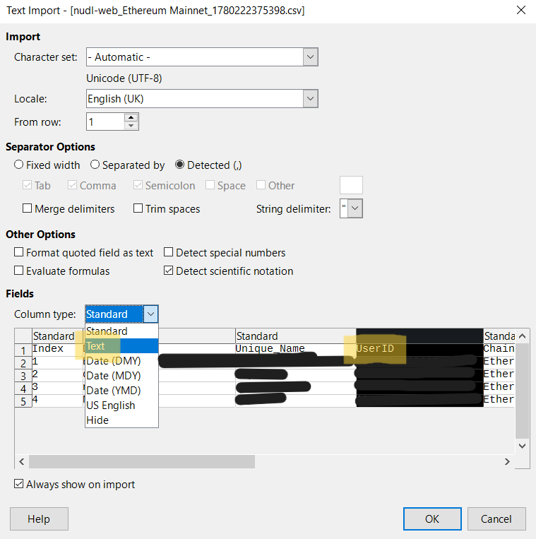

## Error messages

   
>ℹ️ ***Information:** Nudl* can only process users who have registered their wallet addresses in Nudl. If Nudl is unable to locate a user due to misspellings, non-existence, or the absence of a submitted wallet address, an alert ⚠️ will be triggered. The total transfer amount displayed serves as an additional verification tool for you to cross-check against your original disbursement calculations.

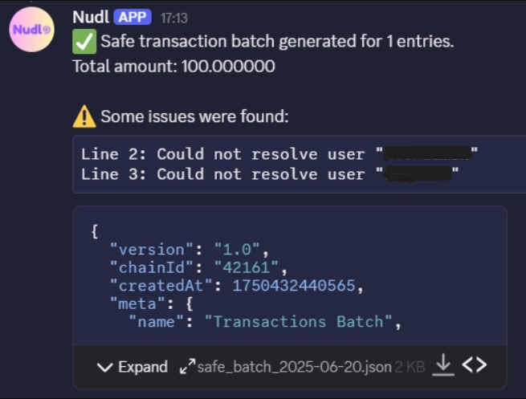

## Formatting

>ℹ️ ***Information:*** Nudl is format sensitive. If you enter the data into the Payout modal without the preset “,“, Nudl will not be able to read the data entry and you will receive an error message:

## Glossary of Terms

We use the following terms interchangeably in the docs.  

- Disbursement: A formal transfer of funds from an organization’s account, fund, or wallet to pay obligations or allocate money for a specific purpose; used in accounting, legal, and compliance contexts and typically recorded for reconciliation.
- Payout: A transactional transfer of money to a recipient (individual or entity) as the result of an event or entitlement (e.g., earnings, rewards, claims); used in product-facing or operational contexts to describe payments made to users.

## External References

asdfad

# 📅 Calendar & Events

Important dates and upcoming events.

- To be announced on our Discord server

# 💡 Tips & Best Practices

- Visit our announcements on Discord for regular updates
- Track your transactions by saving the disbursement files

# 🤝 Feedback & Support

How users can provide feedback or get help:

- Contact us on [Discord](https://discord.gg/Ze93jKYz) for questions, issues or feedback.
- Regular open office meetings: to be announced on our Discord server